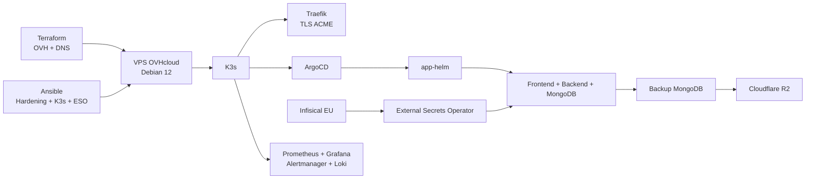

# K3s GitOps Platform

[](https://github.com/roxane451/k3s-gitops-platform/actions/workflows/ci.yml)


Plateforme d'hébergement complète pour une application web conteneurisée (frontend, backend, MongoDB), déployée sur un VPS OVHcloud avec K3s. Ce dépôt couvre l'Infrastructure as Code, le durcissement système, GitOps, la gestion des secrets, l'observabilité et les procédures de sauvegarde / restauration.

> **Dépôt vitrine.** Version publique et anonymisée d'une infrastructure réellement exploitée
> en production. Le nom de l'application, le domaine (`example.com`) et les valeurs propres
> à l'environnement (IP, identifiants Infisical, organisation HCP Terraform, email ACME,
> CIDR d'administration) ont été remplacés par des noms génériques, des placeholders ou des
> variables d'environnement. La structure, les choix techniques et les procédures sont ceux
> de l'infrastructure réelle. Le code applicatif et le chart Helm (`app-helm`) restent privés.

## Architecture en un coup d'œil



## Ce que ce dépôt démontre

| Domaine | Mise en œuvre |
|---|---|
| Infrastructure as Code | Terraform : zone DNS OVH, VPS importé dans le state, state distant HCP Terraform, provisioning de nouveaux VPS désactivé par défaut |
| Configuration système | Ansible, Debian 12, durcissement SSH, UFW, fail2ban et mises à jour automatiques |
| Kubernetes | K3s, Traefik, namespaces prod/préprod, RBAC et NetworkPolicies |
| GitOps | ArgoCD + Helm, synchronisation automatique en préprod et validation manuelle en production |
| Secrets | Infisical EU + External Secrets Operator |
| Observabilité | Prometheus, Alertmanager, Grafana et Loki |
| Résilience des données | CronJobs MongoDB, sauvegardes externalisées et procédures de restore-test / restore-prod |
| Exploitation | Makefile, runbooks d'incident et procédures de reconstruction |
| Qualité | CI GitHub Actions (Terraform, tflint, ansible-lint, yamllint, kubeconform, gitleaks) et hooks pre-commit |

## Flux de déploiement

```text
Terraform
   ↓
Ansible
   ↓
K3s + Traefik + External Secrets Operator
   ↓
ArgoCD
   ↓
app-helm
   ↓
Production / Préproduction
```

La préproduction est gérée par ArgoCD avec `prune` et `selfHeal`. La production utilise une synchronisation ArgoCD manuelle afin de conserver une étape de contrôle avant application.

## Structure

```text
k3s-gitops-platform/
├── terraform/              # OVH, DNS, state et préparation du provisioning VPS
├── ansible/                # hardening, K3s, ESO et bootstrap Infisical
│   └── roles/              # rôles locaux : os_hardening, infisical, k3d
├── k8s/
│   ├── argocd/             # Applications GitOps prod / préprod
│   ├── external-secrets/   # intégration Infisical / ESO
│   ├── monitoring/         # Prometheus, Grafana, Alertmanager, Loki
│   ├── scripts/            # utilitaires Kubernetes
│   └── traefik/            # configuration Traefik / ACME
├── runbooks/               # restauration de données et reconstruction VPS
├── archive/                # premiers manifests bruts, avant le passage à Helm + ArgoCD
├── .github/workflows/      # CI
├── DEPLOY_PRODUCTION.md
├── DEPLOY_PREPROD.md
└── Makefile
```

## Prérequis

- Terraform 1.x
- Ansible 2.15+
- `kubectl`
- Helm
- ArgoCD CLI
- accès OVH API
- accès Infisical

Les dépendances Ansible (rôle `xanmanning.k3s`, collections) ne sont pas versionnées :

```bash
cd ansible && ansible-galaxy install -r requirements.yml
```

Pour le développement local, le dépôt contient également une configuration k3d.

## Configuration

Aucune valeur propre à l'infrastructure n'est versionnée. Les valeurs d'exécution
sont fournies par variables d'environnement :

| Variable | Utilisation |
|---|---|
| `OVH_VPS_IP` | IP du VPS, lue par l'inventaire Ansible |
| `ADMIN_CIDR` | accès SSH / API K3s (UFW) et UI ArgoCD (Traefik) |
| `LETSENCRYPT_EMAIL` | compte ACME, injecté dans la config Traefik via `envsubst` |

Les credentials (OVH, Infisical) restent dans Infisical ; voir [`terraform/README.md`](terraform/README.md).

Placeholders à renseigner pour réutiliser le dépôt :

| Fichier | Placeholder |
|---|---|
| `terraform/backend.tf` | `<HCP_TERRAFORM_ORG>` |
| `terraform/.infisical.json` | `workspaceId` (régénéré par `infisical init`) |
| `k8s/external-secrets/cluster-secret-store.yaml` | `<INFISICAL_PROJECT_SLUG>` |
| `k8s/argocd/application-*.yaml` | `<GITHUB_USER>` (dépôt du chart Helm) |
| `terraform/terraform.tfvars`, manifests | domaine `example.com` |

## Déploiement

Les procédures détaillées sont documentées dans :

- [`DEPLOY_PRODUCTION.md`](DEPLOY_PRODUCTION.md)
- [`DEPLOY_PREPROD.md`](DEPLOY_PREPROD.md)

Avant toute application Terraform :

```bash
cd terraform
terraform fmt -check
terraform validate
infisical run --env preprod -- terraform plan -var-file=terraform.tfvars
```

L'étape `plan` reste volontairement séparée de l'application afin de contrôler les changements avant modification de l'infrastructure.

## Exploitation

Quelques cibles utiles :

```bash
make status                    # état des workloads et ressources principales
make backup-test               # déclenche un backup manuel non destructif
make restore-test              # vérifie la restaurabilité d'un backup
make check-restore-prereqs     # garde-fous avant une restauration production
make sync-prod                 # synchronisation ArgoCD production
make dashboards                # régénère les ConfigMaps Grafana
```

La restauration production exige explicitement `CONFIRM=yes` et doit suivre le runbook associé.

## Secrets

Chaîne utilisée :

```text
Infisical EU
   ↓
External Secrets Operator
   ↓
ExternalSecret / ClusterSecretStore
   ↓
Kubernetes Secret
   ↓
Workload
```

Les credentials locaux et fichiers sensibles sont exclus par `.gitignore`. Les fichiers `*.tfvars`, clés privées, certificats locaux et variables d'environnement ne doivent pas être versionnés.

## Monitoring et diagnostic

Le dépôt contient la configuration de la stack de supervision ainsi que des dashboards et règles d'alerte. Le diagnostic combine :

```text
Métriques Prometheus
+ alertes Alertmanager
+ dashboards Grafana
+ logs Loki
+ état Kubernetes
```

Cette approche permet de distinguer un défaut de collecte d'un défaut de production de logs ou d'un problème applicatif.

## Sauvegarde et restauration

Les sauvegardes MongoDB sont exécutées par CronJob. Les procédures sont volontairement séparées entre :

- sauvegarde ;
- restore-test non destructif ;
- restore-prod avec garde-fous explicites.

Voir [`runbooks/restore-data.md`](runbooks/restore-data.md).

## Runbooks

| Incident | Procédure |
|---|---|
| Perte / reconstruction du VPS | [`runbooks/rebuild-vps.md`](runbooks/rebuild-vps.md) |
| Perte ou corruption des données MongoDB | [`runbooks/restore-data.md`](runbooks/restore-data.md) |

## Intégration continue

Chaque push et pull request exécute :

| Job | Contrôles |
|---|---|
| Terraform | `fmt -check`, `init -backend=false`, `validate`, `tflint` |
| Ansible | installation des dépendances Galaxy, `ansible-lint` (profil `production`) |
| YAML & Kubernetes | `yamllint`, `kubeconform` (y compris CRD ArgoCD, ESO, Traefik, Prometheus Operator) |
| Secrets | `gitleaks` sur tout l'historique Git |

Les mêmes contrôles de base tournent en local via `pre-commit`.

## Autres dépôts

| Dépôt | Rôle |
|---|---|
| [`helm-fullstack-chart`](https://github.com/roxane451/helm-fullstack-chart) | chart Helm générique réutilisable |
| [`devops-toolkit`](https://github.com/roxane451/devops-toolkit) | commandes et runbooks DevOps réutilisables |
| [`devops-tool`](https://github.com/roxane451/devops-tool) | handbook technique MkDocs |

## Choix d'architecture

Le projet utilise actuellement un cluster K3s single-node, adapté au périmètre du projet. La haute disponibilité du control plane n'est donc pas revendiquée ; une évolution multinœud constitue une perspective d'extension (préparée dans `terraform/ovh_vps_ordering.tf`).

Pistes d'amélioration identifiées :

- accès d'administration (SSH, API K3s, ArgoCD) via un VPN dédié (WireGuard / Tailscale) plutôt qu'une allowlist IP ;
- passage des Applications ArgoCD en *app of apps* pour déclarer aussi la stack de monitoring ;
- cluster multinœud avec datastore etcd embarqué.

## Licence

[MIT](LICENSE)
